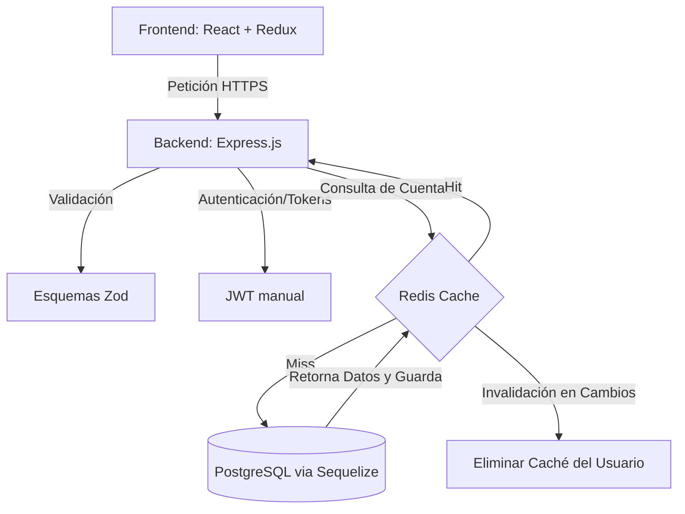

# JimmyBank - Portal de Banca Digital (Fase 1: MVP)

JimmyBank es una plataforma de banca digital diseñada para ofrecer un servicio seguro, responsivo y de alto rendimiento. En esta primera fase (MVP), permite a los usuarios registrarse, iniciar sesión, crear múltiples cuentas digitales (Vista, Ahorro, Corriente) con saldos en pesos enteros y gestionar sus balances, además de proporcionar un panel de administración para el bloqueo y desbloqueo de cuentas.

---

## 1. Stack Tecnológico & Decisiones de Arquitectura

El proyecto está construido bajo una arquitectura desacoplada y moderna, justificando la selección de sus tecnologías clave:

### Backend
- **Core**: Node.js v18+ con Express.js (ES Modules) para un desarrollo rápido y escalable.
- **Base de Datos Relacional**: PostgreSQL como motor principal para garantizar integridad transaccional (propiedades ACID) y consistencia financiera.
- **ORM**: Sequelize para modelar relaciones y automatizar la sincronización de esquemas.
- **Caché (Redis)**: Implementación de la estrategia **Cache-Aside**. Se utiliza para datos de lectura intensiva como balances y listados de cuentas, reduciendo los tiempos de respuesta del servidor a ~5ms y aliviando la carga de consultas sobre PostgreSQL. La caché de cada usuario se invalida inmediatamente ante operaciones de mutación (creación, bloqueo, etc.).
- **Validación (Zod)**: Primera línea de defensa (*fail-fast*) para la validación y saneamiento de payloads en peticiones HTTP. Previene que datos malformados o inválidos lleguen a la base de datos y provee un tipado seguro en el entorno.
- **Seguridad**: Autenticación mediante **JWT manual** estructurado en dos fases: un Access Token de corta duración (15 min) y un Refresh Token rotativo y de larga duración (7 días) almacenado de forma segura. Contraseñas encriptadas en formato Hash usando **BcryptJS** con factor de coste de encriptación (Salt) 12.
- **Logging**: Winston Logger centralizado para registrar eventos importantes del ciclo de vida y stack traces de excepciones.
- **Testing**: Jest + Supertest para asegurar la consistencia funcional de los flujos de la API.

### Frontend
- **Framework**: React v18+ estructurado sobre Vite (Build Tool de alto rendimiento).
- **Manejo de Estado**: Redux Toolkit para gestionar el estado local global de autenticación y cuentas de forma limpia y reactiva.
- **Biblioteca de UI**: Material-UI (MUI) configurada con un tema oscuro premium personalizado, fuentes sofisticadas (*Outfit* e *Inter*), animaciones fluidas y colores HSL.
- **Cliente HTTP**: Axios con interceptores personalizados encargados de adjuntar tokens de autorización y encolar peticiones concurrentes para realizar una rotación transparente del Access Token ante respuestas de expiración `401`.
- **Enrutamiento**: React Router DOM v6 con guardias de ruta y redirecciones según perfil de usuario.

---

## 2. Características Clave (Features Highlight)

- **🔒 Seguridad Avanzada**: Cifrado irreversible de credenciales con BcryptJS y ciclo de vida de sesión protegido por tokens duales (rotación transparente mediante interceptores de Axios ante códigos `401 Unauthorized`).
- **⚡ Rendimiento Optimizado**: Capa de almacenamiento en caché en memoria con Redis para estados de cuenta activos de los clientes.
- **🛡️ Acceso Basado en Roles (RBAC)**: Endpoints y vistas protegidas según el perfil del usuario (Cliente, Administrador General, Administrador de Cuentas).
- **💵 Soporte de Moneda Nacional**: Estructura de cuentas bancarias y validaciones adaptadas para pesos enteros, previniendo incoherencias con decimales.

---

## 3. Arquitectura y Flujo de Datos



---

## 4. Estructura del Repositorio

```text
AppBankJimmy/
├── backend/
│   ├── src/
│   │   ├── config/          # Configuración de base de datos, Redis y logger
│   │   ├── middleware/      # Auth JWT, validación Zod y handler de errores
│   │   ├── controllers/     # Controladores de la API (Auth y Cuentas)
│   │   ├── services/        # Capa opcional de lógica
│   │   ├── models/          # Modelos de Sequelize y esquemas Zod
│   │   ├── routes/          # Enrutadores de Express (/api/auth, /api/accounts)
│   │   ├── utils/           # Helpers de JWT
│   │   ├── database/        # Sincronización y siembra (seeders)
│   │   └── server.js        # Inicialización del servidor
│   ├── tests/               # Pruebas de integración Jest
│   ├── package.json
│   └── .env.example
│
├── frontend/
│   ├── src/
│   │   ├── components/      # UI components comunes
│   │   ├── pages/           # Vistas principales (Login, Register, Dashboard, Admin)
│   │   ├── services/        # Cliente Axios personalizado (api.js)
│   │   ├── store/           # Configuración de Redux Store y Slices
│   │   ├── theme.js         # Tema customizado de MUI (Dark Mode)
│   │   ├── App.jsx          # Enrutador general y cargador de proveedores
│   │   └── main.jsx         # Punto de montaje React
│   ├── index.html           # Plantilla base y tags de SEO
│   ├── package.json
│   └── vite.config.js
│
└── docker-compose.yml       # Orquestador local de PostgreSQL y Redis
```

---

## 5. Estado del Despliegue en la Nube

Actualmente, el proyecto se encuentra en proceso de despliegue en producción:
- **Frontend (React)**: Desplegado en **Vercel** | Link de Acceso: [JimmyBank Portal](https://jimmy-bank.vercel.app)
- **Backend (Express)**: Desplegado en **Render** (apuntando a la carpeta `backend/` y conectado a una base de datos PostgreSQL de producción en Render).

---

## 6. Despliegue y Puesta en Marcha Local

### Requisitos Previos
- [Node.js](https://nodejs.org/) (versión 18 o superior).
- [Docker Desktop](https://www.docker.com/products/docker-desktop/) (para levantar Postgres y Redis). En caso de no usar Docker, puedes usar una instalación nativa de PostgreSQL en Windows y configurar las credenciales en tu `.env`.

### Paso 1: Levantar Infraestructura con Docker
En la raíz de la carpeta `AppBankJimmy`, ejecuta:
```bash
docker-compose up -d
```
Esto creará dos contenedores locales:
- **PostgreSQL**: Puerto `5432`
- **Redis**: Puerto `6379`

### Paso 2: Configurar e Iniciar el Backend
1. Navega al directorio del backend:
   ```bash
   cd backend
   ```
2. Instala los paquetes:
   ```bash
   npm install
   ```
3. Configura las variables de entorno. Hay un archivo `.env` configurado por defecto para desarrollo local. Si requieres ajustarlo, edita el `.env` guiándote con `.env.example`.
4. Inicia el servidor:
   ```bash
   npm run dev
   ```
   *Nota: Al arrancar por primera vez, el servidor creará de forma automática las tablas e insertará de forma automática los datos semilla (seeders) necesarios para pruebas:*
   - **Cliente de pruebas**: `cliente@bank.com` | Clave: `Jimmy1234` (Con una Cuenta Vista de $1.500 lista para usar)
   - **Administrador General**: `admin@bank.com` | Clave: `Jimmy1234`
   - **Administrador de Cuentas**: `admincuentas@bank.com` | Clave: `Jimmy1234`

### Paso 3: Configurar e Iniciar el Frontend
1. Abre una nueva terminal en la raíz y navega al frontend:
   ```bash
   cd frontend
   ```
2. Instala las dependencias:
   ```bash
   npm install
   ```
3. Arranca el entorno de desarrollo Vite:
   ```bash
   npm run dev
   ```
4. Abre tu navegador en la dirección mostrada en consola (habitualmente `http://localhost:5173`).

---

## 7. Comandos Útiles de Desarrollo

### En la carpeta `backend/`
- `npm run dev`: Inicia el servidor de desarrollo Express con recarga automática en cambios (Nodemon).
- `npm start`: Inicia el servidor Express en modo de producción.
- `npm run test`: Ejecuta la suite de pruebas unitarias con soporte de ES Modules mediante Jest.

### Pruebas de Integración (`backend/`)
Ejecuta la suite de pruebas para verificar el flujo crítico del negocio:
* Autenticación (Login correcto, rechazo de credenciales inválidas).
* Refresco de sesión mediante Refresh Token válido/inválido.
* Creación de cuentas bloqueadas por falta de fondos iniciales o validación de Zod errónea.

### En la carpeta `frontend/`
- `npm run dev`: Levanta el servidor local de desarrollo de Vite.
- `npm run build`: Compila y genera los archivos de distribución listos para producción en la carpeta `dist/`.
- `npm run preview`: Sirve localmente los archivos compilados en la carpeta `dist/` para verificar el comportamiento de producción.

---

## 🚀 Próximos Pasos y Mejoras (Roadmap)

Con el fin de evolucionar JimmyBank de un MVP hacia una plataforma de grado financiero en producción, se tienen contempladas las siguientes integraciones en el mediano plazo:

1. **☁️ Despliegue Simplificado y Backend Serverless (Supabase & Vercel)**:
   - Migración o integración de la base de datos PostgreSQL hacia **Supabase** (Database-as-a-Service) para eliminar la necesidad de administrar servidores físicos de bases de datos, delegar la seguridad y habilitar suscripciones en tiempo real mediante WebSockets.
   - Despliegue del backend en **Railway** o **Render** y el frontend React en **Vercel** (con integración continua automática en cada push).
2. **📧 Plantillas de Correo (HTML Email Templates)**:
   - Integración de **Nodemailer** y **Resend** para el envío automático de notificaciones de transacciones.
   - Creación de plantillas HTML responsivas para confirmaciones de registro, estados de cuenta mensuales y alertas de inicio de sesión sospechosos.
3. **🔑 Autenticación de Doble Factor (2FA / OTP)**:
   - Implementación de códigos temporales **OTP (One-Time Password)** generados mediante aplicaciones autenticadoras (Google Authenticator) utilizando el estándar **TOTP** (provisto por Supabase Auth o librerías del backend).
   - Requerimiento de 2FA obligatorio para acciones críticas como cambios de contraseña, transferencias de altos montos e historial de auditorías.
4. **📲 Pagos mediante QR Dinámico**:
   - Generación de códigos **QR dinámicos** en tiempo real para cobros y transferencias rápidas entre cuentas del mismo banco o compras directas en comercios.
   - Procesamiento de transferencias leyendo códigos QR desde la cámara del dispositivo.
5. **📱 Aplicación Móvil (React Native)**:
   - Portar la aplicación a dispositivos móviles iOS y Android utilizando **React Native** / **Expo**.
   - Reutilización de la misma API REST del backend y gran parte de la lógica de estados de Redux Toolkit para una experiencia móvil nativa.

---

## 🖼️ Vistas del Aplicativo
*(Aquí puedes adjuntar capturas de pantalla de la interfaz cuando la ejecutes localmente)*

- **Pantalla de Acceso (Login)**: Formulario estilizado de ingreso con modo oscuro.
- **Dashboard del Cliente**: Visualización de balances totales y tarjetas interactivas de cuentas bancarias.
- **Panel Administrativo**: Gráficos de estadísticas globales y tabla interactiva para el bloqueo y desbloqueo de cuentas.

---

## 🧑‍💻 Autor

Desarrollado por **César Rubilar**  
*Junior Full Stack Developer & Técnico Analista Programador*

Este proyecto refleja y consolida el conocimiento adquirido tanto durante mi formación académica en el **Instituto Profesional San Sebastián** como en mi **práctica profesional**, complementado con el estudio autodidacta de tecnologías modernas, librerías de vanguardia y buenas prácticas en desarrollo web full stack.
